# ATIS Dataset - Exploratory Data Analysis & Decisions

If exploratory data analysis (EDA) is not your thing, you can skip to the [Modeling Decisions](#important-next-steps) section. However, I highly recommend going through this EDA as it will help us understand the dataset better and make informed decisions about the model training process.

## Overview

This document summarizes the Exploratory Data Analysis (EDA) performed on the ATIS (Airline Travel Information Systems) dataset, focusing initially on the **train split**. The goal of this analysis is to understand the dataset's characteristics, distributions, and potential patterns relevant for building an intent classification model. A similar analysis should be conducted on the **test split** to understand its properties and compare distributions.

The analysis was conducted using a Python script (`analysis.py`) leveraging libraries such as Pandas, Dask (optional), NLTK, Matplotlib, and Seaborn. The script performs various analyses and generates visualizations saved in the `plots/` directory.

## Dataset Details

*   **Source:** ATIS (Airline Travel Information Systems)
*   **Splits Analyzed:** Train (Test placeholder included)
*   **Format:** Assumed TSV (Tab-Separated Values) with no header row initially.
*   **Columns:**
    *   `atis_text`: The raw user utterance (e.g., "show flights from boston to denver").
    *   `atis_labels`: The corresponding intent label (e.g., "flight").
*   **Task:** Multiclass classification (predicting the intent from the utterance).


## IMPORTANT: Handling Combined Intents: Multi-Class vs. Multi-Label

A key observation from the EDA is the presence of combined intent labels (e.g., `aircraft+flight+flight_no`, `ground_service+ground_fare`, `flight+airfare`). This indicates that some utterances inherently represent multiple user intentions simultaneously. This presents a choice to us in how to frame the modelling problem:

**Option 1: Treat as Multi-Class (Simple & Easy)**

*   **Approach:** Keep each combined label (like `flight+airfare`) as a single, distinct class.
*   **Implementation:** This is the default approach if no label preprocessing is done. Standard multi-class classification models and loss functions (e.g., Cross-Entropy Loss with softmax output) can be used directly.
*   **Pros:**
    *   Easier initial implementation.
    *   Uses standard widely available multi-class loss functions and frameworks.
*   **Cons:**
    *   Ignores the underlying relationship between the combined intents (e.g., doesn't explicitly leverage that `flight+airfare` contains `flight` information).
    *   **IMP:** Creates a larger number of classes overall!!!.
    *   **IMP:** Leads to extremely sparse/rare classes for the combined labels, making them hard for the model to learn effectively (as seen in the EDA results below where combined labels have very few instances).

**Option 2: Treat as Multi-Label (More Accurate Representation)**

*   **Approach:** We preprocess the combined labels by unpacking them into their constituent intents. For example, an utterance labeled `flight+airfare` would be assigned both the `flight` label *and* the `airfare` label.
*   **Implementation:**
    *   We would have to preprocess labes, typically converting labels into a **multi-hot encoded vector** (e.g., a vector of length `num_base_classes` where multiple positions can be '1').
    *   Requires a model architecture capable of multi-label prediction.
    *   Requires an appropriate loss function (e.g., summed **Binary Cross-Entropy** or averaged across labels, like `BCEWithLogitsLoss`).
    *   Requires multi-label specific evaluation metrics (like Hamming Loss, subset accuracy, F1-score per label, micro/macro/samples F1-score).
*   **Pros:**
    *   **IMP:** More accurately models the real-world scenario where a single query can have multiple intents.
    *   May improve learning for the constituent intents by providing more diverse examples.
    *   **IMP:** Reduces the total number of *base* intent classes the model needs to distinguish directly (though it learns combinations).
*   **Cons:**
    *   Requires more complex data preprocessing.
    *   Requires adjustments to the model architecture, loss function, and evaluation metrics compared to standard multi-class setup.


## IMPORTANT: NEXT STEPS

As we have seen above, given that the combined labels are very rare and represent a real phenomenon of multi-intent utterances, pursuing the **Multi-Label Classification** approach (outlined in the **3rd section**) is likely to yield a more robust and representative model, despite the increased implementation complexity.

This will involve:

* Preprocessing the labels to unpack combined intents into their constituent parts.

* Select a pretrained multilingual baseline & a SOTA LLMmodel architecture capable of multi-label classification.

* Implement light-weight adapters or fine-tuning strategies to adapt the model for multi-label outputs.

* Implement a multi-label loss function and different evaluation metrics.

* Evaluate the model on the test set, considering the data drift and class imbalance.

* Benchmark the **multi-label** baseline model's performance against the **multi-class** baseline approach to validate the benefits of the multi-label strategy.


## EDA Script

The EDA was performed using `analysis.py`, which utilizes the `TextDatasetExplorer` class. Key functionalities include:
*   Loading data using the `CustomTextDataset` utility (supports Pandas/Dask).
*   Basic text cleaning (lowercasing, punctuation removal).
*   Calculating dataset statistics.
*   Analyzing target variable distribution and imbalance.
*   Analyzing text length (character and word counts).
*   Analyzing vocabulary (frequency, common/rare words).
*   Analyzing N-gram frequencies (bigrams, trigrams).
*   Visualizing Zipf's law distribution.
*   Analyzing text length variations across different classes.
*   Saving generated plots to the `plots` directory.

---

## Train Dataset EDA Results

This section details the findings from analyzing the **train split** of the ATIS dataset.

### 1. Basic Information

*   **Shape:** The training dataset contains 4634 samples and 2 columns.
*   **Columns & Types:** The text column is `atis_text` (string), and the label column is `atis_labels` (also string).
*   **Missing Values:** No missing values were found in either column.


### 2. Target Variable (Intent) Distribution

*   **Unique Classes:** There are 22 unique intent labels in the training data.
*   **Imbalance:** The dataset is highly imbalanced, with the `flight` intent being overwhelmingly dominant (3426 instances). The ratio between the most frequent (`flight`) and least frequent classes (several with only 1 instance) is 3426.0. This imbalance is a critical factor for model training (consider class weighting, resampling, or appropriate metrics).

**Plot:**

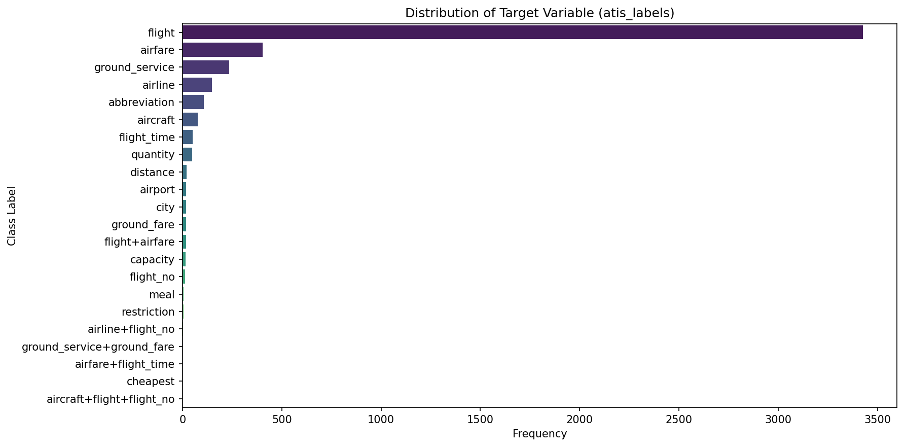

**Distribution Counts:**
```python
target_distribution: atis_labels flight 3426 airfare 403 ground_service 235 airline 148 abbreviation 108 aircraft 78 flight_time 52 quantity 49 distance 20 airport 18 city 18 ground_fare 17 flight+airfare 17 capacity 16 flight_no 12 meal 6 restriction 5 airline+flight_no 2 ground_service+ground_fare 1 airfare+flight_time 1 cheapest 1 aircraft+flight+flight_no 1 Name: count, dtype: int64[pyarrow]

num_classes: 22

imbalance_ratio: 3426.0
```


### 3. Text Length Analysis

*   **Character Length:** Utterances range from 6 to 257 characters, with an average length of ~65 characters.
*   **Word Length:** Utterances range from 1 to 46 words, with an average length of ~11-12 words. The distributions appear relatively normal, centered around the mean.

**Plot:**

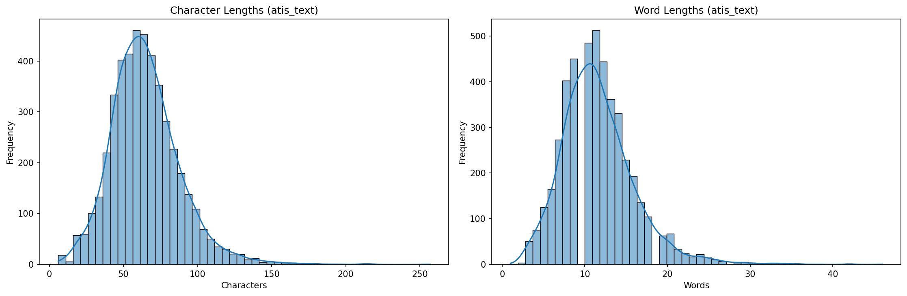

**Statistics:**
```python
char_length_stats: count 4634.000000 mean 64.943246 std 23.362819 min 6.000000 25% 50.000000 50% 63.000000 75% 77.000000 max 257.000000 Name: atis_text, dtype: float64

word_length_stats: count 4634.000000 mean 11.583729 std 4.456665 min 1.000000 25% 9.000000 50% 11.000000 75% 14.000000 max 46.000000 Name: atis_text, dtype: float64
```


### 4. Vocabulary Analysis

*   **Vocabulary Size:** After removing stopwords and non-alphanumeric tokens, the vocabulary consists of 789 unique words.
*   **Most Common Words:** Terms related to flights, locations (boston, san francisco, denver), and requests (show, like, list) are most frequent.
*   **Least Common Words:** Many words appear only once, including specific numbers, less common verbs, and potentially typos or dataset-specific terms.

**Plot (Top 25 Words):**

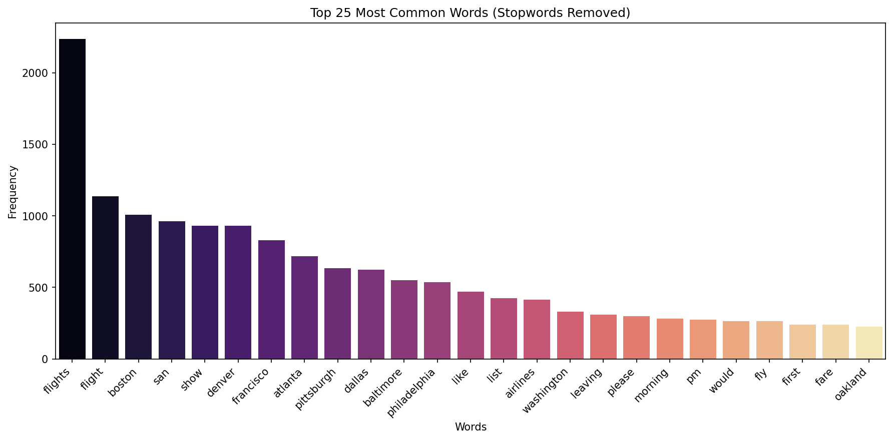

**Word Frequencies:**
```python
vocabulary_size: 789

most_common_words: [('flights', 2237), ('flight', 1139), ('boston', 1009), ('san', 963), ('show', 932), ('denver', 930), ('francisco', 831), ('atlanta', 718), ('pittsburgh', 634), ('dallas', 623), ('baltimore', 550), ('philadelphia', 535), ('like', 469), ('list', 426), ('airlines', 413), ('washington', 332), ('leaving', 310), ('please', 298), ('morning', 283), ('pm', 273), ('would', 265), ('fly', 263), ('first', 239), ('fare', 238), ('oakland', 227)]

least_common_words: [('scenario', 1), ('working', 1), ('417', 1), ('819', 1), ('nighttime', 1), ('163', 1), ('twelve', 1), ('oak', 1), ('largest', 1), ('afternoons', 1), ('gets', 1), ('closest', 1), ('priced', 1), ('1940', 1), ('companies', 1), ('seventeen', 1), ('advertises', 1), ('takes', 1), ('enroute', 1), ('1300', 1), ('sd', 1), ('1209', 1), ('listings', 1), ('hold', 1), ('1500', 1)]
```


### 5. N-gram Analysis (Stopwords Removed)

Analyzing sequences of words (n-grams) helps identify common phrases relevant to the airline domain.

#### Bigrams (2-word sequences)

Common bigrams often represent location pairs (san francisco, boston san), requests (show flights, list flights), or specific concepts (ground transportation, round trip, first class).

**Plot (Top 25 Bigrams):**

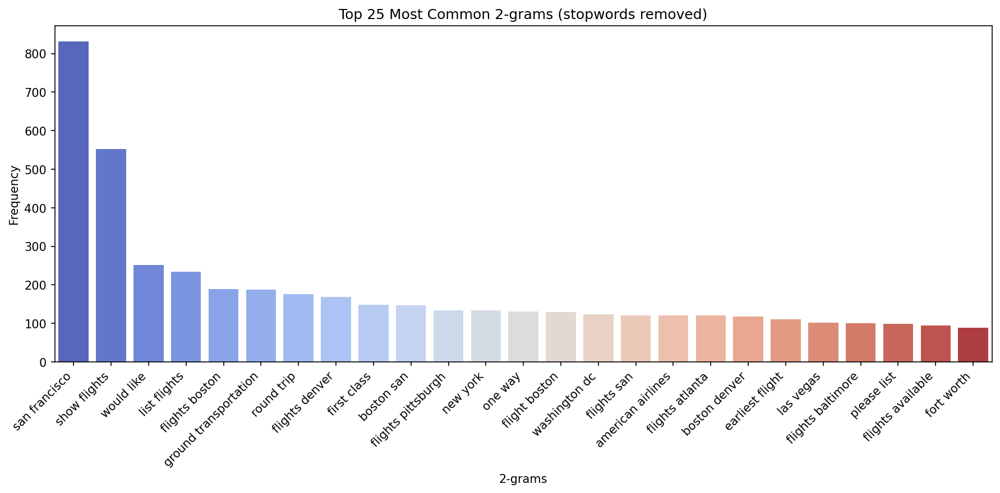


#### Trigrams (3-word sequences)

Trigrams further specify requests, often including origin-destination pairs (boston san francisco, denver san francisco) or more detailed queries (show flights boston, cheapest one way).

**Plot (Top 25 Trigrams):**

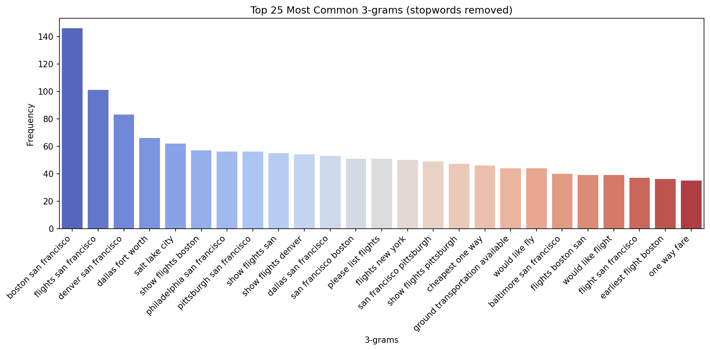

**Frequencies:**

```python
most_common_3grams_stopwords_removed: [('boston san francisco', 146), ('flights san francisco', 101), ('denver san francisco', 83), ('dallas fort worth', 66), ('salt lake city', 62), ('show flights boston', 57), ('philadelphia san francisco', 56), ('pittsburgh san francisco', 56), ('show flights san', 55), ('show flights denver', 54), ('dallas san francisco', 53), ('san francisco boston', 51), ('please list flights', 51), ('flights new york', 50), ('san francisco pittsburgh', 49), ('show flights pittsburgh', 47), ('cheapest one way', 46), ('ground transportation available', 44), ('would like fly', 44), ('baltimore san francisco', 40), ('flights boston san', 39), ('would like flight', 39), ('flight san francisco', 37), ('earliest flight boston', 36), ('one way fare', 35)]
```

### 6. Zipf's Law Analysis

Zipf's law suggests that the frequency of a word is inversely proportional to its rank. The plots show the word frequency vs. rank on a log-log scale. The observed data roughly follows the trend of the ideal Zipf line (slope -1), especially for higher-ranked words, which is typical for natural language corpora.

**Plots:**

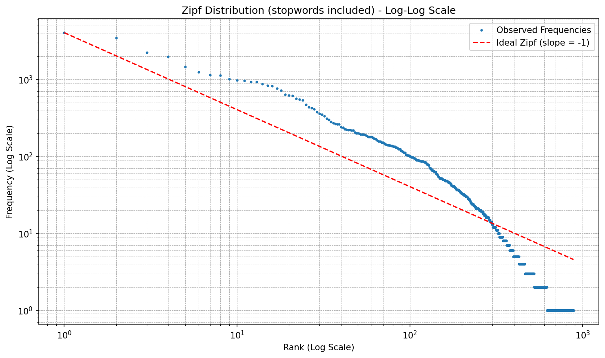

### 7. Text Length by Class Analysis

Analyzes intent length per output class label. This helps identify if certain classes have longer or shorter utterances, which may influence model performance by acting as a strong prior.

*   Some intents associated with specific information requests (like `aircraft+flight+flight_no`, `airline+flight_no`, `flight_no`) tend to have longer average word counts.
*   Intents related to abbreviations (`abbreviation`) or simple entities (`airport`, `city`) tend to have shorter average word counts. This suggests length could potentially be a weak feature.

**Plot:**

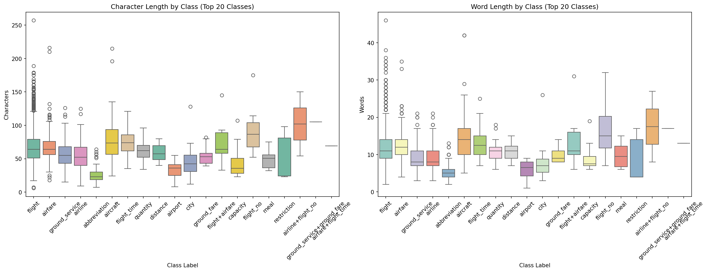


### Train Data Conclusion

The EDA on the ATIS training dataset revealed several key characteristics:
*   **High Class Imbalance:** The `flight` intent dominates, requiring careful handling during modeling.
*   **Common Themes:** Queries frequently involve specific locations (Boston, SF, Denver, etc.) and actions (show, list, like).
*   **Phrase Patterns:** N-grams highlight common location pairs and request structures specific to the airline domain.
*   **Length Variation:** Utterance length varies somewhat predictably with intent complexity.
*   **Natural Language Properties:** Word frequencies generally adhere to Zipf's law.

These insights are valuable for feature engineering, model selection, and evaluation strategies for the intent classification task.

---

## Test Dataset EDA Results

This section is for the EDA of the **test split**. The same analyses performed on the train split are repeated here to understand the test data distribution and check for potential dataset drift. Instead of repeating all the subsections as we did for train split, we illustrate the plots, summarize the findings & highlight any significant differences or similarities with the train split.

**Plots:**

<!-- Create plot with caption -->
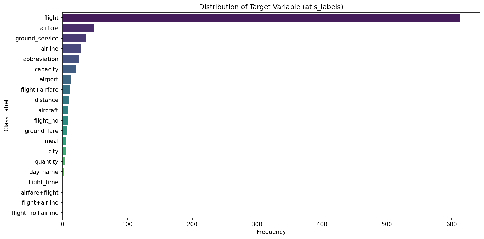
*Caption: Test Target Distribution for Test Dataset*

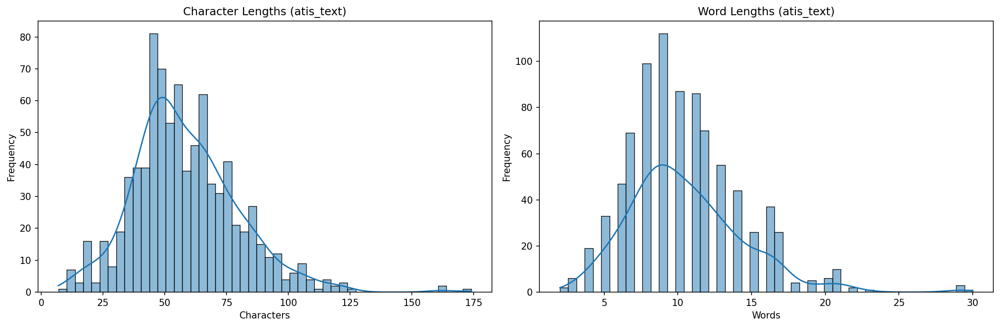
*Caption: Test Text Length Distribution for Test Dataset*

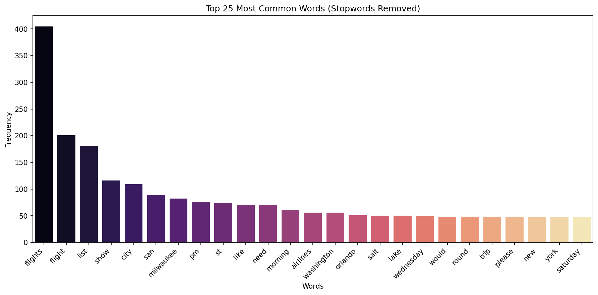
*Caption: Top 25 Words for Test Dataset*

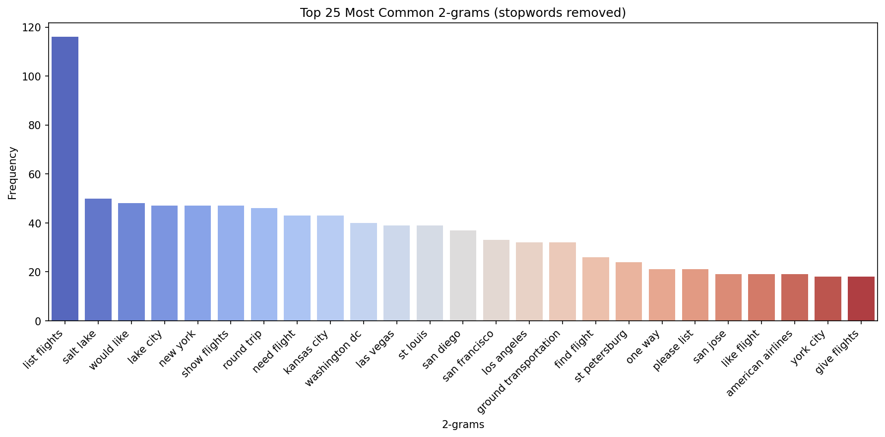
*Caption: Top 25 Bigrams for Test Dataset*

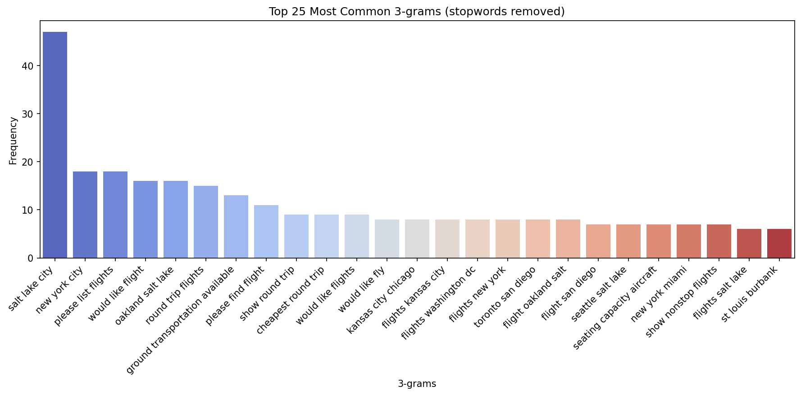
*Caption: Top 25 Trigrams for Test Dataset*

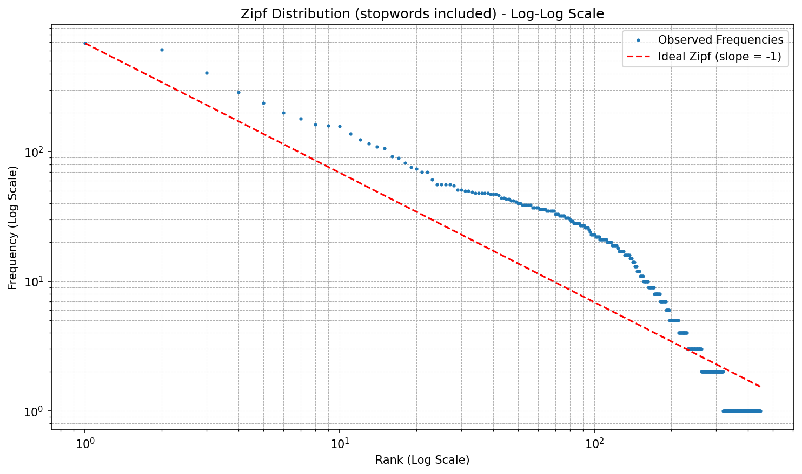
*Caption: Zipf Distribution for Test Dataset*

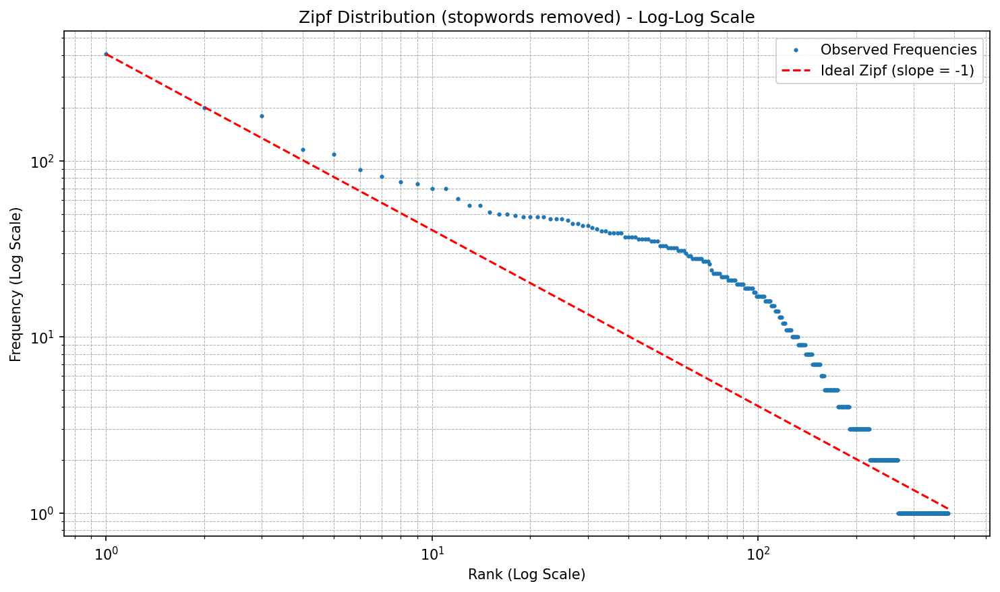
*Caption: Zipf Distribution (Stopwords Removed) for Test Dataset*

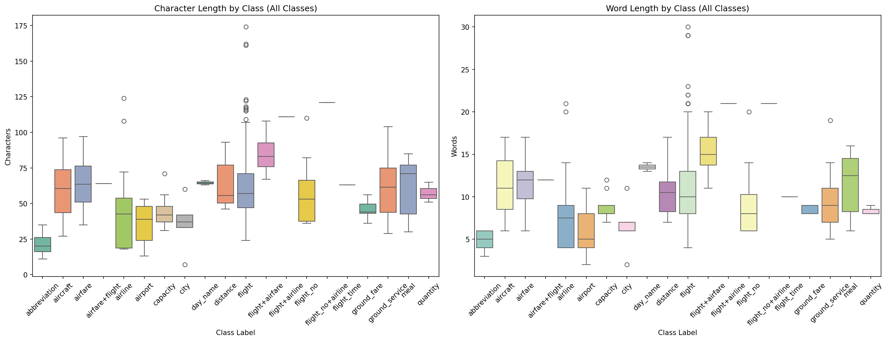
*Caption: Sequence Length by Class for Test Dataset*


### Comparison: Test vs. Train Data & Key Insights

Comparing the test set analysis against the training set reveals several key differences and potential challenges:

*   **Dataset Size:** The test set (850 samples) is significantly smaller than the train set (4634 samples), which might lead to less statistically robust evaluation on rare classes.
  
*   **Class Distribution Drift:**
    *   **Missing/New Classes:** The test set has fewer classes (20 vs. 22). Several rare intent classes present in the train set are absent in the test set. Crucially, the test set contains a new class (`day_name`) not seen during training, which the model will likely misclassify.
    *   **Imbalance Ratio:** While both sets are dominated by the `flight` intent, the test set is considerably *less* imbalanced (ratio ~613) compared to the train set (ratio ~3426). This difference in relative class frequencies should be noted during evaluation.
*   **Content/Vocabulary Shift:**
    *   **Entities:** There's a noticeable shift in the prominent locations mentioned. While core terms (`flights`, `list`) overlap, the test set features locations like Milwaukee, Salt Lake City, Kansas City, and St. Louis more heavily in its top words and n-grams, whereas the train set emphasized Boston, SF, Denver, and Atlanta.
    *   **Phrasing:** The most common bigram in the test set is `list flights`, while it was `san francisco` followed by `show flights` in the train set. Similarly, top trigrams differ significantly (`salt lake city` vs. `boston san francisco`).
*   **Text Length:** Test set utterances are slightly shorter on average (mean words ~10.5 vs ~11.6) and have a smaller maximum length, potentially indicating slightly less complex queries on average.
*   **Vocabulary Size:** The test set has a much smaller unique vocabulary (382 vs 789 words), largely due to its smaller size but also reflecting the content shift.

**Implications (Data Drift):**

The differences in class distribution (missing/new classes), imbalance ratio, and particularly the shift in common entities (locations) and phrasing (n-grams) strongly suggest **data drift** between the train and test sets. The model's ability to generalize to the different location focus and potentially different phrasing styles present in the test set will be crucial for performance. 

The presence of an unseen class (`day_name`) guarantees some errors and highlights a limitation of the training data coverage relative to this specific test set. Evaluating performance requires careful consideration of these distributional differences.
